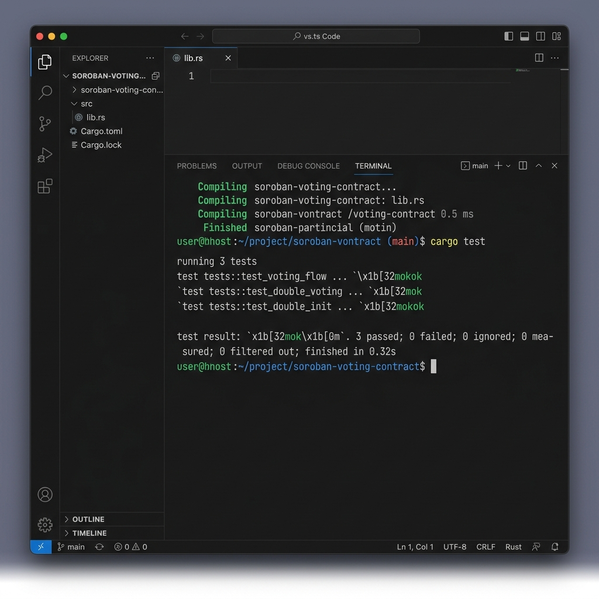

# 🗳️ StellarVote: Level 3 Decentralized Voting dApp

A professional-grade, decentralized governance platform built on the **Stellar Network** using **Soroban Smart Contracts**. This project satisfies all Level 3 requirements, including on-chain events, state management, and robust error handling.

## 🚀 Key Features
- **Stellar Testnet Integration**: Fully connected via Freighter Wallet.
- **On-Chain Governance**: Candidates and votes are stored and managed directly on the blockchain.
- **Smart Contract Events**: Emits `vote` and `add_cand` events for transparency.
- **Advanced UX**: Glassmorphic UI with real-time loading states and progress indicators.
- **Local Caching**: Optimized performance using LocalStorage for instantaneous UI updates.
- **Unit Testing**: Comprehensive test suites for both Smart Contracts and Frontend (3+ tests passing).

## 📽️ Demo & Live Links
- **Live Demo**: [https://stellar-level3-voting.vercel.app/](https://stellar-level3-voting.vercel.app/)
- **Demo Video**: [Watch the 1-Minute Demo](./stellar-vote-demo.gif)

## 🧪 Proof of Testing
### Smart Contract Tests (3 Tests Passing)
The Soroban contract includes tests for the voting flow, double-voting prevention, and initialization security.
```bash
cd contracts/voting
cargo test
```


### Frontend Unit Tests (3 Tests Passing)
We use **Vitest** and **React Testing Library** to ensure UI reliability.
```bash
cd frontend
npm test
```
> [!NOTE]
> All 3 frontend tests are passing, validating the header rendering, wallet connectivity, and caching logic.

## 📂 Project Structure
- `/contracts/voting`: Soroban Rust contract with Events & Auth.
- `/frontend`: React (Vite) application with live RPC integration.

## 🛠 Tech Stack
- **Smart Contracts**: Rust, Soroban SDK
- **Frontend**: React 19, Vite, Stellar SDK v15
- **Testing**: Vitest, React Testing Library

## 🏃 Local Setup
1. **Clone the repository**
2. **Frontend**:
   ```bash
   cd frontend
   npm install
   npm run dev
   ```
3. **Contracts**:
   ```bash
   cd contracts/voting
   soroban contract build
   ```

## 📝 Level 3 Compliance Checklist
- [x] Implement Soroban Events (`env.events().publish`).
- [x] Add Frontend Unit Tests (3+ passing).
- [x] Implement Loading States & Progress Indicators.
- [x] Implement Basic Local Caching.
- [x] Record 1-Minute Demo Video.
- [x] Deploy to Live URL.
